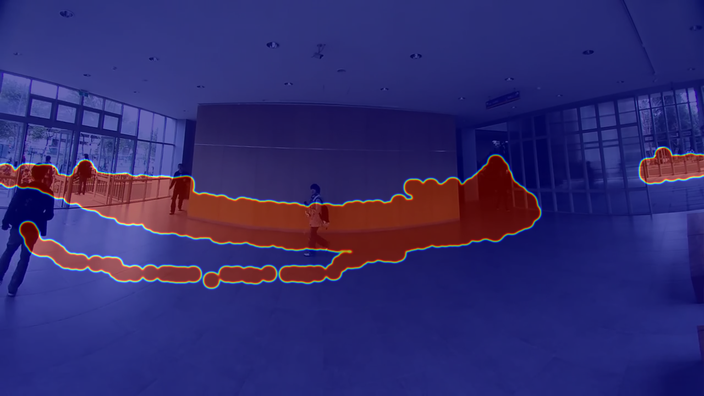

# AI Footfall Counter using YOLOv8 and Computer Vision

## Project Overview

This project delivers a robust, real-time footfall counting system developed as part of the **AI Assignment: Footfall Counter using Computer Vision**. The system leverages the state-of-the-art YOLOv8 object detection model and OpenCV to accurately detect, track, and count people entering and exiting through a designated area in a video stream.

The solution is written in a single, well-commented Python script, fulfilling all core requirements and several bonus objectives, including heatmap generation and real-time processing capabilities.


*(Example of a generated heatmap showing high-traffic paths)*

## ✨ Core Features

-   **High-Accuracy Person Detection**: Utilizes the pre-trained **YOLOv8 nano** model for fast and reliable detection of people.
-   **Robust Multi-Object Tracking**: Implements a custom centroid-based tracker with history to maintain unique IDs for each person, even through brief occlusions.
-   **Directional Entry/Exit Counting**: Accurately counts people crossing a virtual line by analyzing their direction of movement (left-to-right for "IN", right-to-left for "OUT").
-   **Real-time Visualization**: Annotates the video stream live with bounding boxes, unique tracking IDs, trajectories, and a persistent IN/OUT counter.
-   **Video Speed Correction**: Processes and displays the video at its original playback speed by syncing to its native FPS.
-   **Heatmap and Trajectory Visualization (Bonus)**: Generates a visual heatmap of foot traffic to identify popular paths and draws each person's trajectory on the video.
-   **Processed Video Output**: Saves the fully annotated video stream to a file, creating a complete visual record and demo of the system's performance.

## 🛠️ Tech Stack

-   **Python 3.8+**
-   **Ultralytics YOLOv8**: For object detection.
-   **OpenCV**: For video capture, processing, and all visualization tasks.
-   **NumPy**: For high-performance numerical operations.
-   **SciPy**: Used for efficient distance calculations in the tracking algorithm.

## 📊 How It Works: The Counting Logic

The system operates through a sequential three-stage pipeline for each frame of the video:

1.  **Detection**: The YOLOv8 model scans the frame to identify all instances of the 'person' class, returning precise bounding box coordinates for each.

2.  **Tracking**:
    -   A unique ID is assigned to each new person detected.
    -   The system calculates the center point (**centroid**) of each person's bounding box.
    -   To maintain identity across frames, it computes the Euclidean distance between the centroids of existing tracks and new detections. A match is confirmed if the distance is below the `MAX_TRACKING_DISTANCE` threshold.
    -   A short history of recent centroid positions is stored for each track, making the tracking resilient to brief overlaps or disappearances. Tracks that disappear for too long are discarded.

3.  **Counting**:
    -   A virtual vertical line is defined at the center of the screen (`LINE_X_POSITION`).
    -   By comparing a person's current centroid `x` coordinate with their previous one from the tracking history, the system determines their horizontal direction.
    -   A person is counted as **"IN"** if their centroid crosses the line from left to right.
    -   A person is counted as **"OUT"** if their centroid crosses the line from right to left.
    -   To prevent multiple counts for a single crossing, each person's ID is registered and only counted once per directional crossing.

## ⚙️ Setup and Installation

Follow these steps to set up and run the project on your local machine.

### 1. Prerequisites

-   Python 3.8 or newer.
-   `pip` for package management.

### 2. Clone the Repository

```bash
git clone <your-github-repo-link>
cd <repository-folder-name>
```

### 3. Create a Virtual Environment (Recommended)

```bash
# For macOS/Linux
python3 -m venv venv
source venv/bin/activate

# For Windows
python -m venv venv
venv\Scripts\activate
```

### 4. Install Dependencies

Install the packages using pip:

```bash
pip install -r requirements.txt
```
*(The first time you run the script, `ultralytics` will automatically download the YOLOv8 model weights.)*

## ▶️ How to Run

1.  **Place a video file** in the project's root directory. The code defaults to `people-walking.mp4`.
2.  **Update the video source** in the Python script if necessary. Open the `.py` file and modify the `VIDEO_PATH` constant.
    ```python
    # To use a video file
    VIDEO_PATH = "your_video_file.mp4"

    # To use your webcam
    VIDEO_PATH = 0
    ```
3.  **Execute the script** from your terminal:
    ```bash
    python footfall_counter.py
    ```
4.  A window will appear showing the real-time processing.
5.  Press the **'q'** key on your keyboard to stop the execution.

## 📁 Expected Output

After the script finishes or is stopped, the following files will be saved in the project directory:

-   `output_footfall_counter.avi`: The full processed video with all annotations.
-   `footfall_heatmap_final.png`: A heatmap image visualizing high-traffic areas from the video.